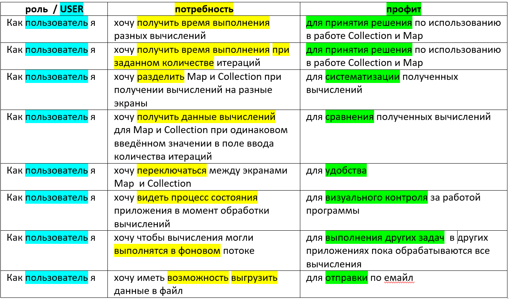
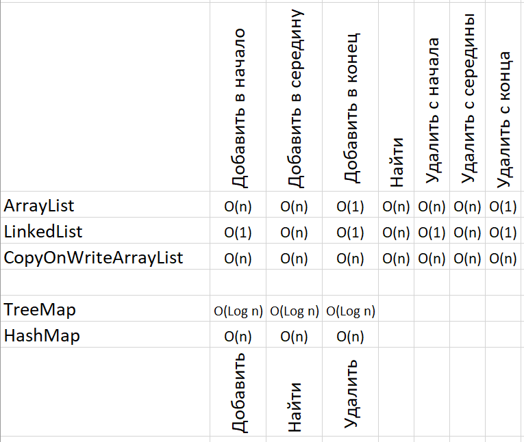

# Collections and Maps

Приложение вычисляет время выполнения операций для Collections и Maps

Для collections (ArrayList, LinkedList, CopyOnWriteArrayList):
1.	Добавить items в начало
2.	Добавить items в середину
3.	Добавить items в конец
4.	Найти item
5.	Удалить все items с начала
6.	Удалить все items с середины
7.	Удалить все items с конца

Для maps (TreeMap, HashMap):
1.	Добавить items
2.	Найти item
3.	Удалить все items
 

### Liblaries

[Butterknife](http://jakewharton.github.io/butterknife/) for view binding.

[Retrolambda](https://github.com/evant/gradle-retrolambda) for Java 8 support.

## User Stores

## Complexity analysis

## Author

* *Aleksandr Kovalenko* - [Facebook](https://www.facebook.com/aliaksandr.kavalenka.7)

## License

    Copyright 2018 Aleksandr Kovalenko

    Licensed under the Apache License, Version 2.0 (the "License");
    you may not use this file except in compliance with the License.
    You may obtain a copy of the License at

       http://www.apache.org/licenses/LICENSE-2.0

    Unless required by applicable law or agreed to in writing, software
    distributed under the License is distributed on an "AS IS" BASIS,
    WITHOUT WARRANTIES OR CONDITIONS OF ANY KIND, either express or implied.
    See the License for the specific language governing permissions and
    limitations under the License.
